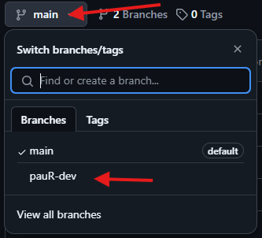
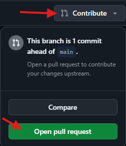
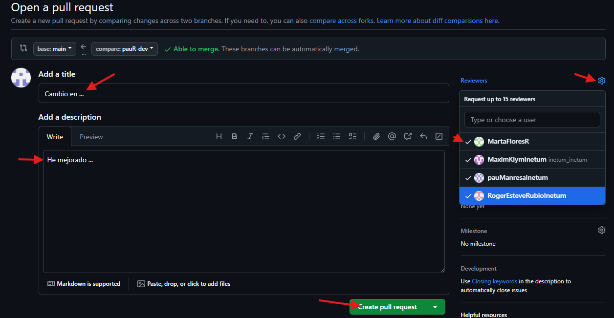
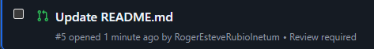
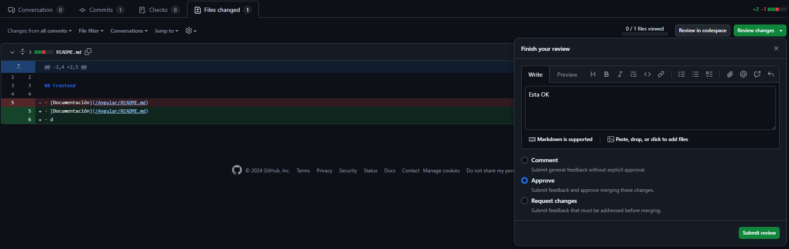
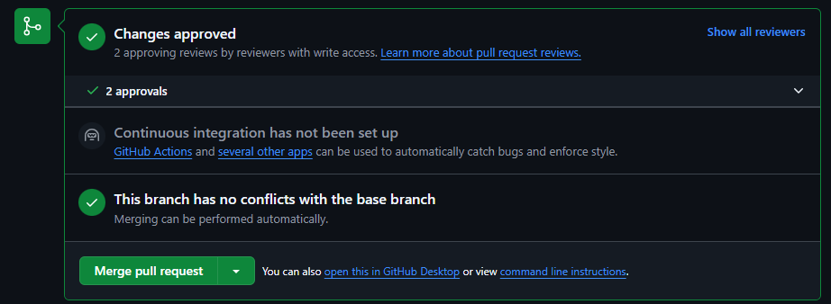

# COMO USAR GIT

## Pasos para subir a la rama `main`

1. **`git branch nombre-dev` Solo la primera vez, nombre-dev cambiar por tu nombre (ej, pauR-dev)**
2. **`git add .`**
3. **`git commit -m "CAMBIOS HECHOS"`**
4. **`git pull` Solo el repo local esta desactualizado**
5. **`git push -u origin nombre-dev` nombre-dev es el nombre de la rama creada inicialmente**
6. **Abrir el proyecto de github en el navegador y entrar en tu rama**

7. **Abrir la PR**

8. **Crea la PR** 
- El titulo y la descripción deben de descriptivos e intuitivos
- Se deben de añadir los revisores que quieras (pueden ser todos o solo un minimo de 2)

## Aceptar una PR

1. Ir a Pull Request en GitHub web

2. Entrar en la PR

3. Revisar que todo este OK y testear en local `git switch nombre-dev`
 

4. El ultimo revisor debe de hacer merge

5. Borrar la rama al acabar
 

