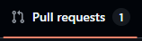
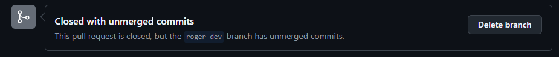

# COMO USAR GIT

## Pasos para subir a la rama `main`

> [!important]
>  El punto **2**, **3** Y **4** son de vital importancia

1. **`git branch nombre-dev` Solo la primera vez, nombre-dev cambiar por tu nombre (ej, pauR-dev)**
1.1. **`git switch nombre-dev` Cambias a la rama de desarrollo**
2. **Cerrar el Visual Studio 2022 y abrir el Visual Studio Code**
3. **Descartar los cambios NO hechos por ti (Puedes seleccionar varios a la vez con Ctrl o Shift)**

![[../img/git_discart.png]]

4. **Añadir los cambios SI por ti con "Stage Changes" (Puedes seleccionar varios a la vez con Ctrl o Shift)**

![[../img/git_stage.png]]

5. **`git commit -m "CAMBIOS HECHOS"`**
6. **`git pull` Solo el repo local esta desactualizado**
7. **`git push -u origin nombre-dev` nombre-dev es el nombre de la rama creada inicialmente**
8. **Abrir el proyecto de github en el navegador y entrar en tu rama**

7. **Abrir la PR**

8. **Crea la PR** 
- El titulo y la descripción deben de descriptivos e intuitivos
- Se deben de añadir los revisores que quieras (pueden ser todos o solo un minimo de 2)

## Aceptar una PR

1. Ir a Pull Request en GitHub web

2. Entrar en la PR

3. Revisar que todo este OK y testear en local `git switch nombre-dev`
 

4. El ultimo revisor debe de hacer merge

5. Borrar la rama al acabar
 

## Pasos para actualizar una rama secundaria en base de la `main`

> main se puede cambiar por cualquier otra rama actualizada

1. **`git checkout nombre-de-la-rama-secundaria` Cambia a la rama secundaria (ej. pauR-dev)**

2. `git checkout main` `git pull origin main` **Actualiza la rama `main` local**

3. `git checkout nombre-de-la-rama-secundaria` **Vuelve a la rama secundaria**

4. `git merge main` **Haz un merge de los cambios de `main` en la rama secundaria**

5. `git push origin nombre-de-la-rama-secundaria` **Sube los cambios a la rama remota secundaria**
